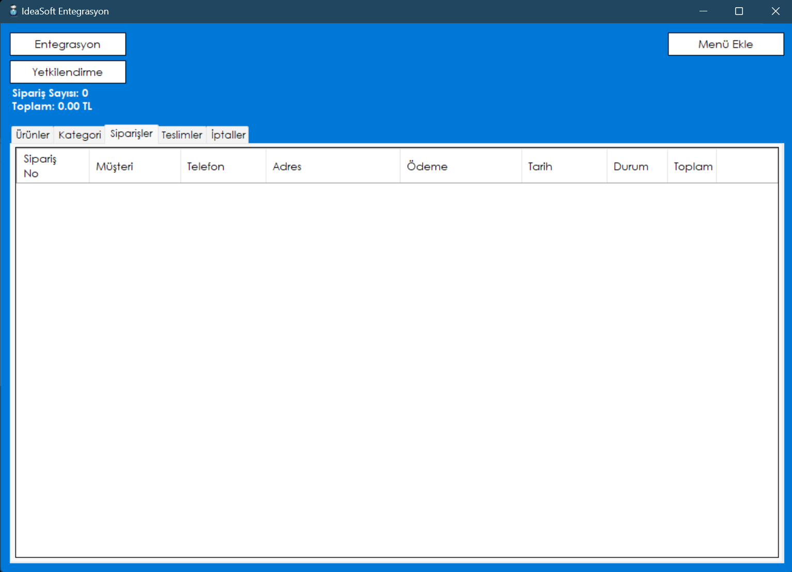

# Idea-Soft-Integration

## About

This project is an integration application developed using the Ideasoft API and WinForms. It facilitates seamless integration between your system and the Ideasoft platform, enabling smooth data exchange and management.

## Screenshot


## Features

- **Ideasoft API Integration**: Connects and interacts with the Ideasoft API for data exchange.
- **WinForms Interface**: Provides a user-friendly interface for managing integration tasks.
- **Data Synchronization**: Ensures synchronization of data between your system and Ideasoft.
- **Error Handling**: Includes mechanisms for handling and logging errors during integration.

## Technologies Used

- **C# WinForms**: Framework for building the desktop application interface.
- **Ideasoft API**: API for integrating with the Ideasoft platform.
- **.NET Framework/Core**: Used for backend logic and operations.
- **Visual Studio**: Integrated development environment used for development.

## Installation

1. **Clone the Repository**:
    ```sh
    git clone https://github.com/BeratARPA/Idea-Soft-Integration.git
    ```
2. **Open with Visual Studio**: Open the project in Visual Studio.
3. **Install Dependencies**: Ensure all necessary dependencies are resolved.
4. **Configure API Credentials**: Set up your Ideasoft API credentials in the configuration file.
5. **Build the Project**: Build the solution to ensure proper setup.
6. **Run the Project**: Press F5 to run the project and access the integration interface.

## Usage

1. **Launch the Application**: Start the application from Visual Studio or the executable.
2. **Configure API Settings**: Enter your Ideasoft API credentials and configure settings as needed.
3. **Manage Integration**: Use the interface to manage and monitor the integration tasks.
4. **View Logs**: Check logs for any errors or issues during integration.

## Contributing

If you would like to contribute, please fork the repository, create a feature branch, and submit a pull request.

## License

This project is licensed under the MIT License. See the [LICENSE](LICENSE) file for more details.

## Contact

For questions or feedback, feel free to contact me:
- **Email**: [beratarpa@hotmail.com](mailto:beratarpa@hotmail.com)
- **GitHub**: [https://github.com/BeratARPA](https://github.com/BeratARPA)
